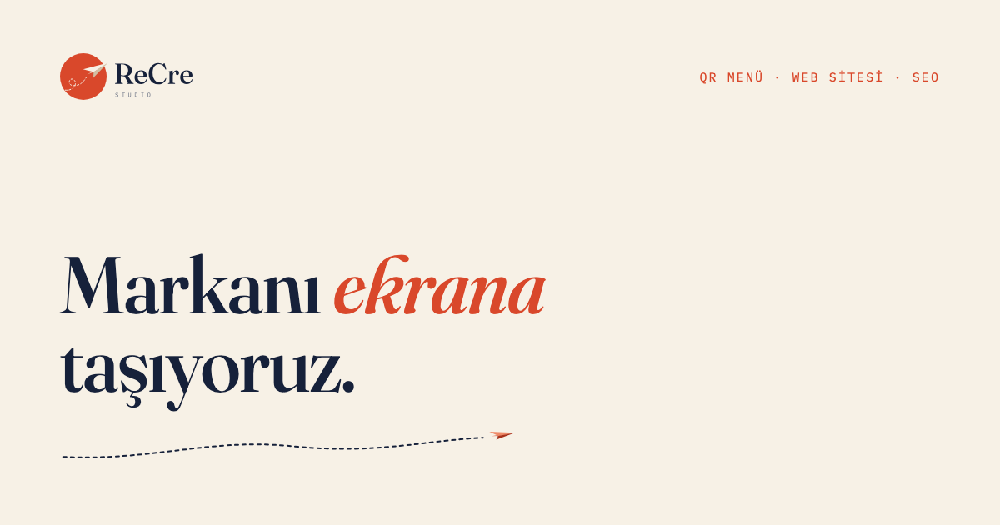

# ReCre Studio — Web Sitesi

**Canlı site:** https://recrestudio-web.vercel.app

Restoranlar, kafeler ve yerel markalar için dijital QR menü, hızlı web siteleri ve SEO hizmeti veren
ReCre Studio'nun tanıtım sitesi. Sayfa kaydırıldıkça ilerleyen 3D bir sahne: kahraman obje telefondan
tarayıcı penceresine, oradan arama sonucuna dönüşerek hizmetleri anlatır.



## Teknoloji

- Düz HTML, CSS ve JavaScript (ES modülleri); derleme adımı yok
- [Three.js](https://threejs.org) — 3D sahne ve `models/hero.glb` modeli
- [GSAP](https://gsap.com) + ScrollTrigger — kaydırmaya bağlı zaman çizelgesi
- [Lenis](https://lenis.darkroom.engineering) — yumuşak kaydırma
- Kütüphaneler `index.html` içindeki import map ile jsDelivr'dan yüklenir

## Yerelde çalıştırma

```sh
python3 -m http.server
```

Sonra tarayıcıda http://localhost:8000 adresini aç. Dosyayı doğrudan (`file://`) açmak çalışmaz,
ES modülleri ve model yüklemesi için bir sunucu gerekir.

## Yapı

| Yol | İçerik |
| --- | --- |
| `index.html` | Sayfa, metinler ve import map |
| `main.js` | Sahne kurulumu, kamera ve kaydırma zaman çizelgesi |
| `transitions.js`, `morph.js`, `playhead.js` | Sahne geçişleri ve dönüşümler |
| `screens.js`, `props.js` | 3D ekranlara canvas ile çizilen içerikler |
| `ui/` | Ortak marka bileşenleri: renk token'ları, butonlar, yükleyici, ilerleme izi |
| `style.css` | Sayfa düzeni |
| `models/`, `assets/`, `fonts/` | 3D model, görseller, Fraunces fontu |
| `data/projects.json` | "İşler" bölümündeki proje kartları (görseller `assets/isler/`) |

## Yayın

`main` dalına yapılan her push Vercel'de otomatik olarak yayınlanır.

## İletişim

recrestudio0@gmail.com · Instagram [@recre_studio](https://instagram.com/recre_studio)

## Lisans

Kod ve marka varlıkları (logo, görseller, 3D model) ReCre Studio'ya aittir; tüm hakları saklıdır.
Fraunces fontu SIL Open Font License ile dağıtılır (`fonts/OFL-Fraunces.txt`).
